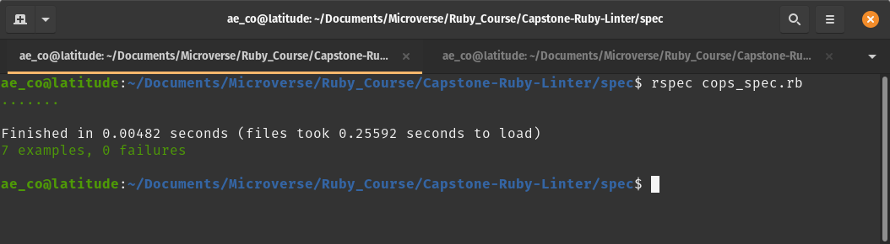

<h1 align="center">[Ruby] Capstone Project / Create your own Linter </h1>
<p>
  
  <a href="#" target="_blank">
    
  </a>
  <a href="https://twitter.com/ae_cordova" target="_blank">
    
  </a>
</p>

___
## Description of the project 

The purpose of this project is to create a basic Linter that can  detect errors on spacing, indentation and line format.

In this case I chose **CSS** as the language to inspect. 

Style checks are based on an unnoficial style guide provided by Paul G Allen School, you can visit the link here: [CSE 154 — Unofficial Style Guide
](https://courses.cs.washington.edu/courses/cse154/17au/styleguide/html-css/spacing-indentation-css.html#indentation)
___

<h3 align="center">Style Rules</h3>

**Indentation:** 
* 2 space indentation or 'soft tabs' for each level

bad code:
```css
div {
 font-size: 18pt;
  color: #222222;
}

  img {
width: 50%;
  }
```

good code:
```css
div {
  font-size: 18pt;
  color: #222222;
}

img {
  width: 50%;
}
```

**Line Format:**
* Just ine line per rule
* Place an empty line between blocks

bad code:
```css
a { color: #111111;
    font-size: 16pt;
}
div {
  color: #222222; font-size: 18pt;
}
```

good code:
```css
a {
  color: #111111; 
  font-size: 16pt; 
}

div {
  color: #222222; 
  font-size: 18pt; 
}
```

**Spacing:**
* Line break after { or } and between each property declaration.
* Spaces between selectors and { } 
* Space after a colon or a comma. 

bad code:

```css
p,h1{color:red; font-family:serif; font-size:16pt;}
a {text-decoration:none}
```

good code:

```css
a {
    text-decoration: none;
}

h1, p {
    color: red;
    font-family: serif;
    font-size: 16pt;
}
```
### ⭐️ How it works

The linter scans file line by line  looking for key characters,
if a certain rule corresponding to each character is not  complied with, it prints an error.

The error message will give you the line number and where applicable, the column it appears at

These  are the possile erros you may encounter:
 - Wrong Indentation, expected X spaces
 - Spacing, expected single space before '{' and'('
 - Spacing, expected single space after ')', ':' and ','
 - Line Format, Expected line break after '{', '}' and ';'
 - Line Format, Expected one empty line after '}'

*Go to Instructions section for an example

### ⭐️ Built with
* Ruby


### Dev Environment Requirements:
* Ruby needs to be installed to run the code check [here](https://www.ruby-lang.org/en/documentation/installation/) for further steps

### ⭐️ Running the code

#### Instructions:

1. Clone the repo

2. Navigate to the project's root folder and run: 
    ```
    $ /bin/css_linter [path-to-file]
    ```
    for example:
    ```
    > $ ./bin/css_linter example.css
    ```
    <i>Note:</i> The file should have executable     permissions:
    ```
    > $ chmod +x bin/css_linter 
    ```
    Or you can run it using the ***ruby***     command:
    ```
    > $ ruby bin/css_linter example.css
    ```
3. Program will scan the file and show you the errors 

    

### ⭐️ Testing with RSpec
#### Instructions:
1. Navigate to the spec folder
    ```
    > $ cd spec
    ```
2.  Run the following command:
    ```
    $ rspec cops_spec.rb
    ```
    Output:
    
    

<!-- CONTRIBUTING -->
## Contributing

Any contributions you make are **greatly appreciated**.

1. Fork the Project
2. Create your Feature Branch (`git checkout -b feature/AmazingFeature`)
3. Commit your Changes (`git commit -m 'Add some AmazingFeature'`)
4. Push to the Branch (`git push origin feature/AmazingFeature`)
5. Open a Pull Request


## Author

👤 **Angel Cordova** 

* Github: [@aecordova](https://github.com/https:\/\/github.com\/aecordova)  
